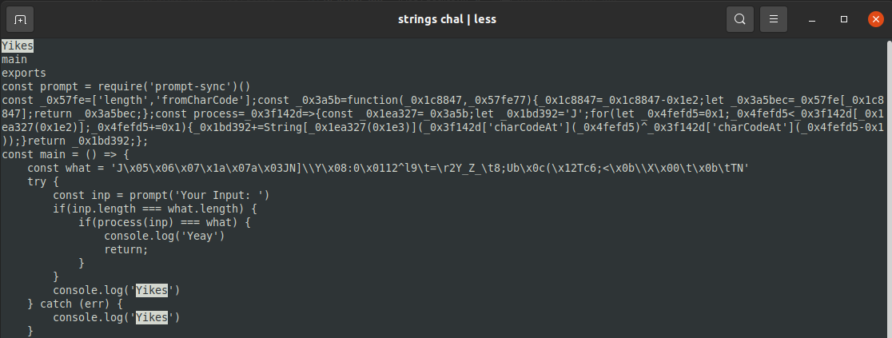

# Desc

I'm not quite satisfied with how the previous flag checker program was written. So I rewrite the entire thing and finally end up in version 8. Hope you can solve this one.

# Note untuk panitia

- isi folder `attachement` diberikank kepada peserta

# Flow singkat solver

Program dibuat dengan javascript (judul soal, `v.8`, juga merupakan hint) lalu di-`compile` dengan [pkg](https://www.npmjs.com/package/pkg). Untuk mendapatkan source code cukup mudah yaitu dengan menjalankan program `strings` (linux), lalu cari kata 'Yikes' (didapat setelah running program dengan input yang salah).



Terlihat logic asli dari program dalam bahasa javascript. Tinggal prettify. Terdapat fungsi `process` yang diobfuscate, tinggal deobfuscate karena fungsinya tidak terlalu rumit.

Tampilan setelah diprettify:

```javascript
const _0x57fe = ['length', 'fromCharCode'];
const _0x3a5b = function (_0x1c8847, _0x57fe77) {
  _0x1c8847 = _0x1c8847 - 0x1e2;
  let _0x3a5bec = _0x57fe[_0x1c8847];
  return _0x3a5bec;
};
const process = (_0x3f142d) => {
  const _0x1ea327 = _0x3a5b;
  let _0x1bd392 = 'J';
  for (
    let _0x4fefd5 = 0x1;
    _0x4fefd5 < _0x3f142d[_0x1ea327(0x1e2)];
    _0x4fefd5 += 0x1
  ) {
    _0x1bd392 += String[_0x1ea327(0x1e3)](
      _0x3f142d['charCodeAt'](_0x4fefd5) ^
        _0x3f142d['charCodeAt'](_0x4fefd5 - 0x1),
    );
  }
  return _0x1bd392;
};
```

Fungsi sebelum diobfuscate:

```javascript
const process = (something) => {
  let result = 'J';
  for (let i = 1; i < something.length; i += 1) {
    result += String.fromCharCode(
      something.charCodeAt(i) ^ something.charCodeAt(i - 1),
    );
  }
  return result;
};
```

# Flag

JOINTS21{5h4me_on_m3_foR_m4k1ng_d1S_we1Rd_ch4lleng3}
